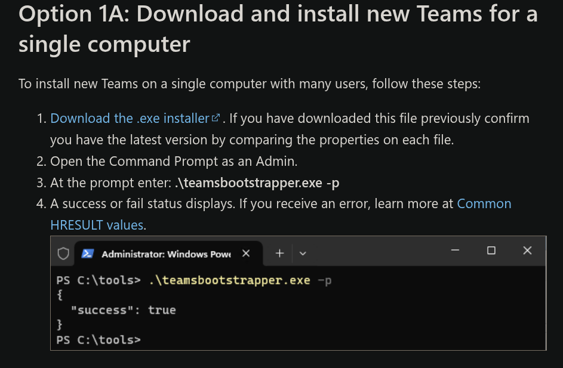

# Contents

 - [Microsoft Teams](#microsoft-teams)
 - [git installation](#git-installation)
 - [New account](#new-account)
 - [Account setup](#account-setup)

# Microsoft Teams

Usually, each user of the system must install Microsft Teams individually. To avoid this situation, you can install a
version available to each computer user:
 >- in the browser, open this [link](https://learn.microsoft.com/en-us/microsoftteams/new-teams-bulk-install-client)
 >- click on `Download the .exe installer` and download the file
 >- open the PowerShell program as an administrator
 >- go to the Downloads directory, e.g. if your username is `john`, type: `cd C:\Users\john\Downloads`
 >- run the installer as shown in the image

# git installation

From [git page](https://git-scm.com/):
>Git is a free and open source distributed version control system designed to handle everything from small to very large projects with speed and efficiency.

Open [link](https://git-scm.com/downloads), download installer and install `git`.

# New account

To separate the software configuration and installation operations (for the security of the main system) a new user account will be created. In case of problems it can be easily deleted without damaging the system.

>- press the `Windows` key and type settings on your keyboard

>- go to Accounts\Other Users\ and press `Add account`

>- click link `Add a user without a Microsoft account`

>- click link `I don't have this person's sign-in information.`

>- enter the account name (in the example it is `python_course`)
>- no password is required for the account - you can set it or not

---

# Account setup
Log in to the new account (in the example it is `python_course`) and:
 1. Go back to settings
 2. Go to the `System/For developers` tab and activate the options shown in the pictures below:
 >- `Developer Mode On`
 >- `File Explorer\Show file extension On`
 >- `File Explorer\Show full path in title bar On`
 >- `Terminal Windows Terminal`
 >- `PowerShell\Change execution policy ... On`

