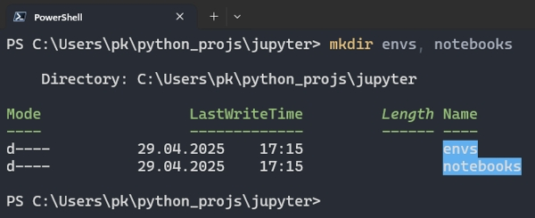
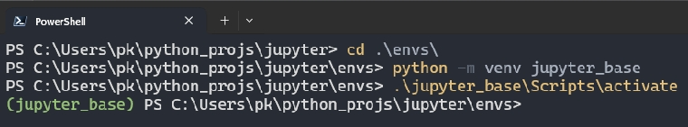

# Jupyter project

From [Project Jupyter Documentation](https://docs.jupyter.org/en/latest/):
>Welcome to the Project Jupyter documentation site. Jupyter is a large umbrella project that covers many different
software offerings and tools, including the popular Jupyter Notebook and JupyterLab web-based notebook authoring and
editing applications. The Jupyter project and its subprojects all center around providing tools (and standards) for
interactive computing with computational notebooks.


# Installation

## Directory structure

```plaintext
C:\Users\my_account\python_course\    - main python course folder
|
+---\data\                            - data shared between projects
|
+---\imgs\                            - images shared between projects
|
+---\projects\                        - directory with exercises/projects
|
+---\jupyter\                         - includes notebooks and jupyter environments
    |   
    +---\envs\                        - directory for storing jupyter kernels (virtual environments not related to projects)
    |   |
    |   +----\jupyter_base\           - jupyter runtime environment
    |   |
    |   +----\edc\                    - sample environment for everyday work (numpy, pandas, scipy, matplotlib)
    |
    +---\notebooks\                   - notebooks not related to any project
```

## Creating directories
In the python course directory, create the following directories (according to the structure shown: 
1. `mkdir jupyter`

  

2. `cd jupyter` -> `mkdir envs` and `mkdir notebooks`

  


## Jupyter base
Create `jupyter base` virtual environments: this is your main environment from which jupyter will be launched. The environment is:
- used to manage jupyter
- not used for work - no other modules will be installed in it except those necessary for jupyter itself to run

```bash
cd envs
python -m venv jupyter_base
```



## Jupyter installation

```bash
cd jupyter  # go to the jupyter directory (if you are not there already)

jupyter_base/Scripts/activate  # activate environment

python -m pip install -U pip jupyter  # jupyter installation
```


# Jupyter and virtual environments

In jupyter, virtual environments are used to work with code. Such environments contain the Python interpreter and are
therefore treated by jupyter as kernels.
For an environment to be a kernel, it must:
>- have the `ipykernel` module installed
>- be installed in jupyter

## Edc environment

An environment for everyday work, with popular data analysis modules installed - list of modules in the file
`edc_requirements.txt`.

1. Create `edc` environment:

 

2. `edc_requirements.txt`
> Copy the file edc_requirements.txt to the directory `../jupyter/envs/`

 


3. Install modules from `edc_requirements.txt` file:

 
 

4. Install the environment in jupyter:
```bash
python -m ipykernel install --user --name=edc --display-name "python_edc"

```

 


5. List kernel
Using 'jojo' you can list the kernels available for jupyter:

 

## Start `Jupyter`:

 >- in the system terminal activate `jupyter_base` environment
 >- write `jupyter lab` - your default web browser window should open and jupyter lab should be launched
 >- write `jupyter lab --no-browser` - jupyter server will be started but, the www browser must be launched by the user
    and the http address must be pasted into it
 

 >- the command should start your default web browser and display the `jupyter notebook` start page
 >- if the start page is not displayed, copy the link displayed in the console, open the browser and paste the link


## Keyboard shortcuts:

 - `a` - inserts a cell above the active cell
 - `b` - inserts a cell below the active cell
 - `ctr + Enter` - run the code stored in the cell
 - `shift + Enter` - run the code stored in the cell and inserts new cell below
 - `m` - changes the cell type to `Markdown`
 - `y` - changes the cell type to `Code`
  

## Magic commands

Magic commands run in `jupyter notebook` as in the` ipython` console. Two types of commands are available:

 - command line commands, preceded by a single `%` character e.g. `%ls` - see [here](https://ipython.readthedocs.io/en/stable/interactive/magics.html#line-magics). 
 - commands to be executed in `jupyter notebook` cells, preceded by a double `% ` sign, e.g. ` %%html ` - see [here](https://ipython.readthedocs.io/en/stable/interactive/magics.html#cell-magics)


